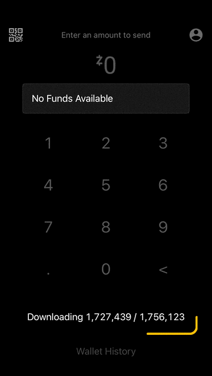
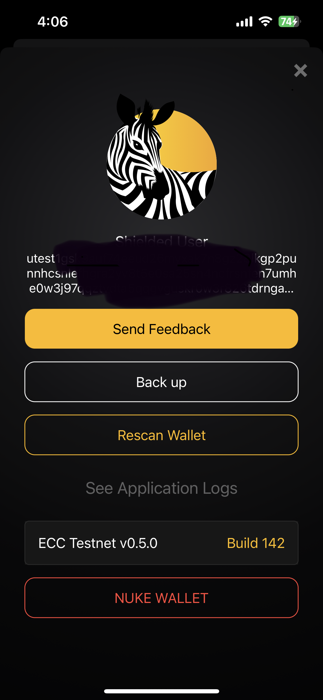
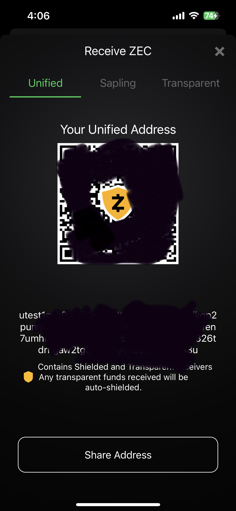

# My Open Source development Porfolio

In the sections belowyou will find the applications, SDKs and tools I've been involved with.

# iOS Applications

## Secant iOS Wallet
Repo: https://github.com/zcash/secant-ios-wallet

Secant is a Zcash wallet built with The Composable Architecture. It's goal is to be a "production-ready" reference wallet that can showcases how wallet builders can take
Zcash into users' hands in a maintainable, feature-rich, modular, testable and robust way.
The project had several UI and feature scope changes that TCA could support graciously
thanks to the separation of concern of application logic and UI logic and consistent
one-way State management that the composable architecture brings. 

## ECC Reference Wallet
Repo: https://github.com/zcash/zcash-ios-wallet

iOS wallet using the Zcash iOS SDK that is maintained by core developers.

This a reference wallet for the following set of features:
- z2z transactions w/ encrypted memos
- reply-to formatted memos
- z2t transactions
- transparent receive-only
- autoshielding on threshold from receive only t-address

# SDKs and other tools

## ZcashLightClientKit
I built the [iOS Zcash SDK](https://github.com/zcash/ZcashLightClientKit/) and the first [ECC reference wallet using SwiftUI](https://github.com/zcash/zcash-ios-wallet) most publicly known as NightHawk Wallet since that Team forked the repo and shipped it to the App Store. But I didn’t do this all by myself. I had my ECC colleagues who helped me all the way. It is necessary to understand a lot of how Zcash works to effectively develop a mobile SDK that can be a “drop-in” kind of tool for developers around the world. This led me to have a good understanding of the Zcash light-client protocol, and “the protocol” itself. I worked back to back with my Android counterpart, since I started the SDK as a “port” from the Android PoC which also let me actively contribute every now and then to that codebase as well. Later on I would have to onboard other great developers to our codebase. So I did end up learning a lot of Kotlin along the way. 

https://github.com/zcash/ZcashLightClientKit/

## Light Client FFI Layer for librustzcash
`zcash-light-client-ffi` is a Rust Foreign Function Interface layer for the Zcash iOS SDK delivered 
through an XCFramework that supports the different architectures that are supported in iOS development.
It allows ZcashLightClientKit clients not to care about any of the Rust developments tools needed to build the "Rust Backend" of the Zcash SDK.
https://github.com/pacu/zcash-light-client-ffi

## MnemonicSwift
BIP-39 Mnemonic phrases implementation for Swift
https://github.com/zcash-hackworks/MnemonicSwift

One of my earliest work in at Electric Coin Company was finding a safe native library for BIP-39 for the Swift programming language. We conducted a survey of existing implementations of BIP-39, forked the one that best suited our SWOT analysis and spawned [MnemonicSwift](https://github.com/zcash-hackworks/MnemonicSwift) and even got it listed in the [Bitcoin wiki page](https://en.bitcoin.it/wiki/BIP_0039)

## Checkmate:
ZIP-307 TreeState checkpoint generator for Zcash Wallets written in Python in just a few minutes that saved our team a ton of hours.
https://github.com/zcash-hackworks/checkmate

## TinyQRScanner:
a base level QR Code scanning application. It uses AVFoundation for scanning the code that I forked and improved upon. This QR Scanner is used in many iOS Zcash wallets.
https://github.com/pacu/TinyQRScanner

## Combine URLSession Downloader
https://github.com/pacu/combine-urlsession-downloader

This is a utility library that encapulates some helpers to leverage Combine and URLSession to download files from the web. 

# Open Source Contributions

## Zcash Rust Crates: Librustzcash
Wallets are an interdisciplinary work. Inevitably, I ended up picking up some Rust Lang skills which helped me be a more effective contributor all across the tech stack by contributing to the Rust backend: LibRustZcash. You can see a list of my modest contributions [here](https://github.com/zcash/librustzcash/pulls?q=is%3Apr+is%3Aclosed+author%3Apacu). One of my most cherished PRs is this one that implements the principles of autoshielding which I had a great collaboration work with ECC’s Core Team to guide me through this implementation which ended up being the backbone for “shielding by default” in our native mobile platforms on [this pull request](https://github.com/zcash/librustzcash/pull/341). 

## Unstoppable Wallet
Unstoppable Wallet are great partner and supporters of the Zcash cause. They have amazing multi-coin native applications for Android and iOS. It took me less than a day to draft a PoC integration to their iOS wallet. That is how modular their code is, pretty awesome. Obviously they took the baton and implemented the whole thing themselves and I helped occasionally as you can see [in a few PRs](https://github.com/horizontalsystems/unstoppable-wallet-ios/pulls?q=is%3Apr+author%3Apacu.

## Zingo Labs

ZingoLabs, to bring darksidewalletd tests to their Zingo wallet by creating a PoC in Rust on how they could leverage this powerful tool (https://github.com/zingolabs/zingolib/pulls?q=is%3Apr+is%3Aclosed+author%3Apacu). I use Zingo Lib for some personal projects of mine and for educational purposes when teaching in college. Zingo team was very engaged with the whole idea of integration tests for wallets and it seems they plan is to take it to the next level.

## Integration testing tooling

Security and Testing were always priorities for our team. Taylor Hornby and Larry Ruane co-created a set of RPCs in lightwalletd server that let developers create a local ZIP-307 compliant synthetic compact blockchain and write integration tests that can reproduce blockchain edge cases. I kind of became the “darksidewalletd guy”. We called this suite “Darksidewalletd Tests” and their first implementation was carried out on ZcashLightClientKit (https://github.com/zcash/ZcashLightClientKit/tree/main/Tests/DarksideTests). This helped our team to be developing on solid grounds knowing that our SDK would react properly to chain re-orgs. Working on these tests also had me working a bit in Go Lang (https://github.com/zcash/lightwalletd/pulls?q=is%3Apr+is%3Aclosed+author%3Apacu) when I caught bugs in Lightwalletd itself.

# Research and Education

## RFP and ZIP Collaboration for the Zcash Ecosystem

Like many other Zcash developers I contributed to ZIPs and RFPs of great relevance to the Ecosystem like [ZIP-317: Proportional Transfer Fee Mechanism](https://github.com/zcash/zips/blob/main/zip-0317.rst) or [ZIP-316: Unified Addresses and Unified Viewing Keys](https://github.com/zcash/zips/blob/main/zip-0317.rst). Also helped drafting the [Zcash UniFFI Library RFP](https://forum.zcashcommunity.com/t/rfp-zcash-uniffi-library/41335)

## Teaching and Lecturing
I taught Introduction to Programming with C from 2009 to 2018 as an assistant professor in different private universities in Buenos Aires. 

Teaching gives people a unique experience where one can learn differently, because “those who teach learn twice”. I like creating documentation, presentations and classes that aim to be appealing and motivating to students.

I’m currently also working as an Assistant Professor in the “Introduction to Blockchain” course at the Faculty of Informatics of the National University

## Research in software engineering
Back in my undergrad college days I also worked in research and development and published different papers about soft computing and text mining. This helped me polish formal aspects of written English and also technical and scientific writing that definitely helped me grasp the protocol all the ZIPs Zcash has. 

I graduated from the Software Engineering Master Degree program of the National University of La Plata with a Thesis that studied Privacy Coin mobile wallets and their architecture and described a framework of software patterns based on reverse engineering requirement analysis of existing non-custodial privacy coin wallet applications. [link in Spanish](https://doi.org/10.35537/10915/137845)

This work derived into a research paper on wallet software design patterns presented at the Pattern Languages of Programs conference of 2022 an early draft can be found [here](https://hillside.net/plop/2022/papers/G1_P3.pdf). According to conference chairs, the paper will be listed in the ACM Library soon. 

# Development "General public" Articles
Whenever I see a that I've tackled a problem that others might be struggling with as well, I like to write about it. Some of these articles have been "rubber ducks" for me. I didn't have a clue of how to solve the issue until I was able to put it into words. 

 Outer pipes  Cell padding 
No sorting
| Title                               | Views | Reads | Read ratio |
| -------------------------------------------------------------------------------------------------------------------------------------- | ----- | ----- | ---------- |
| [Customizing SwiftUI Navigation Bar](https://medium.com/me/stats/post/8369d42b8805?source=main_stats_page)                             | 25K   | 15.5K | 60%        |
| [Supporting Swift Package Manager in your Pod in 5 simple steps](https://medium.com/me/stats/post/d4b76ea80470?source=main_stats_page) | 6.9K  | 2.9K  | 43%        |
| [SwiftUI: Conditionally Showing NavigationItem and ToolbarItem](https://medium.com/me/stats/post/d4d3554d1245?source=main_stats_page)  | 2.2K  | 1.3K  | 59%        |
| [SwiftUI: Working Around no popToRootViewController()](https://medium.com/me/stats/post/e8e1bd9bf312?source=main_stats_page)           | 2.1K  | 1.4K  | 64%        |
| [Introducing Lottie Animations to SwiftUI](https://medium.com/me/stats/post/7f298e324c23?source=main_stats_page)                       | 810   | 522   | 64%        |
| [SwiftUI — Make Content Scrollable when DynamicFont scales up](https://medium.com/me/stats/post/8248d2e47ed7?source=main_stats_page)   | 78    | 68    | 87%        |

# Seminars and Talks

## Hello decentralization Conference:
In February 2021 I participated in a workshop session at “Hello Decentralization” where I did a “code along” session where attendees could build a Point of Sale proof of concept app with ZcashLightClientKit and Swift UI. The session was called “We accept Zcash! building a PoS App with Zcash Viewing keys”. The site of the conference unfortunately is down. I could find this [link](https://www.crowdcast.io/e/hello-decentralization/register?navlinks=false&embed=true) and the repository with the code-along material can be found [here](https://github.com/zcash-hackworks/we-accept-zcash-ios). 

## “Hacia Afuera” podcast
A podcast about latin american professionals making great contributions from the region to all the world. [In this podcast](https://open.spotify.com/episode/5msJJcTCXrnpdV0P1xKvYJ) we discussed blockchain and privacy.

